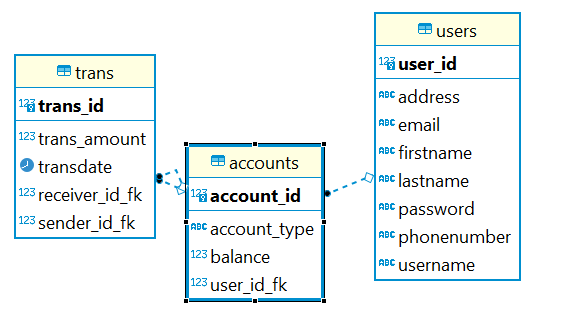

# Minibank

## Executive Summary
Minibank is a simple banking applications. The application consists of a login page, an accounts page (as well as account detail), a user profile, a transfer funds page, and a page to open a new account. At the login page, users can create an account or login with an existing account. If a user has forgot their password, they can use the forgot password link to reset it. Once, logged in, the user is brought to their accounts page, which displays an account number, account type, and balance for that account. An account can be clicked on for a detailed view, where they can use the budget calculator and print a pdf of transactions. The user profile displays the User's information as it is in the database, some fields are editable. The transfer funds page, accessable via the 'transfer' link in the navbar, is where a user can send between their accounts, or to other User's accounts within Minibank. The open account page gives the ability to open an account of type checking or savings. There is an option for dark mode, toggled by a button on the navbar, to change the color scheme. 

## Physical Model

## Technologies Used
- Java
- PostGreSQL
- Angular
- GCP
- Hibernate
- Javalin
